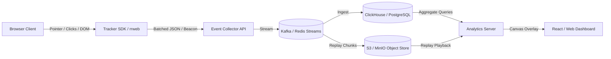

# 🔥 Awesome Heatmap Analytics

<div align="center">
  <a href="https://github.com/ishandutta2007/Awesome-Heatmap-Analytics">
    
  </a>
</div>

<br/>

<div align="center">
  <a href="https://github.com/ishandutta2007/Awesome-Awesome-Awesome"></a><a href="https://discord.gg/jc4xtF58Ve"></a>
  <a href="https://github.com/ishandutta2007/Awesome-Heatmap-Analytics/stargazers"></a>
  <a href="https://github.com/ishandutta2007/Awesome-Heatmap-Analytics/network/members"></a>
  <a href="https://github.com/ishandutta2007/Awesome-Heatmap-Analytics/pulls"></a>
  <a href="https://github.com/ishandutta2007/Awesome-Heatmap-Analytics/blob/main/LICENSE"></a>
  <a href="https://github.com/ishandutta2007"></a>
</div>

---

## 🎯 Top Heatmap Analytics Ecosystem

**The Curated Index of SaaS Platforms & Open-Source GitHub Projects**  
*Focused on Website Heatmaps, Click Tracking, Scroll Depth, Session Replay, Mouse Movement, Rage Clicks & User Behavior Analytics*  
📅 **Last updated: August 2026**

This repository tracks notable **SaaS/Hosted platforms** and **open-source projects** for **Heatmap Analytics**. These tools empower product teams, growth marketers, UX/UI researchers, Conversion Rate Optimization (CRO) specialists, and software engineers to visualize visitor interactions through click maps, scroll maps, mouse movement tracking, visual attention maps, session recordings, conversion funnels, and behavioral analytics.

---

## 📑 Table of Contents

* [📊 SaaS/Hosted Platforms](#-saashosted-platforms)
* [⚡ Open-Source GitHub Projects](#-open-source-github-projects)
* [🏆 Top Open-Source Recommendations](#-top-open-source-recommendations)
* [🗺️ Core Heatmap Types & Visualizations](#️-core-heatmap-types--visualizations)
* [📈 Key Behavioral Analytics Metrics](#-key-behavioral-analytics-metrics)
* [🏗️ Heatmap Analytics Infrastructure Stack](#️-heatmap-analytics-infrastructure-stack)
* [🛡️ Privacy & Compliance Considerations](#️-privacy--compliance-considerations)
* [❓ Frequently Asked Questions (FAQ)](#-frequently-asked-questions-faq)
* [⭐ Star History](#-star-history)
* [🤝 How to Contribute](#-how-to-contribute)
* [📄 Disclaimer](#-disclaimer)

---

## 📊 SaaS/Hosted Platforms

> 📈 **Market Overview & Sector Landscape**: The global Digital Experience Analytics and Heatmap software market is estimated at **$4.8B to $16.5B (2025–2026)** and is projected to expand to **$35B–$57B+ by 2033–2035** (growing at a 12%–15% CAGR). The sector is **moderately fragmented**: while enterprise giants (Contentsquare, Medallia, Adobe) actively acquire leading tools (e.g., Hotjar, Heap, Decibel), the industry remains highly dynamic and competitive due to innovative CRO suites, privacy-conscious platforms, and emerging AI-driven attention tools preventing a single winner-take-all monopoly.

| Product | Company Valuation / Revenue | Description | Pricing | Free Tier / Free Trial Limits |
| :--- | :--- | :--- | :--- | :--- |
| **[Microsoft Clarity](https://clarity.microsoft.com/)** | **~$3.1 Trillion** (Market Cap) / $245B+ Annual Rev | Free behavioral analytics platform providing session recordings, heatmaps, rage-click/dead-click detection, and performance insights. | Free ($0 / month forever) | **Free Forever**: Unlimited sessions, heatmaps, recordings, and websites with no traffic caps |
| **[Zoho PageSense](https://www.zoho.com/pagesense/)** | **~$10+ Billion** (Valuation) / $1.4B+ Annual Rev | Conversion optimization and website analytics platform providing heatmaps, session recordings, funnel analysis, form analytics, and A/B testing. | $16 / month (billed annually for 10,000 monthly tracked visitors) | **Free Forever plan**: 5,000 monthly tracked visitors, 3 active goals (plus 15-day full-feature free trial) |
| **[Yandex Metrica](https://metrica.yandex.com/)** | **~$7.5+ Billion** (Valuation) / $10B+ Annual Rev | Web analytics service providing session replay (WebVisor), click maps, scroll maps, link maps, and form analytics. | Free ($0 / month standard; Metrica Pro starts at ~₽300,000 / month for 500M hits/month) | **Free forever**: Unlimited pageviews, sessions, heatmaps, and session recordings (API limit: 5,000 requests/day) |
| **[Decibel (Medallia DXA)](https://www.decibel.com/)** | **$6.4 Billion** (Acquired by Thoma Bravo) / $550M+ ARR | Digital experience analytics technology providing session replay, behavioral heatmaps, and experience optimization (integrated into Medallia). | $1,250 / month (~$15,000/year entry tier based on Experience Data Records) | **14-day free trial**: Guided proof-of-concept trial upon request (no permanent free tier) |
| **[Contentsquare](https://contentsquare.com/)** | **$5.6 Billion** (Valuation) / $300M+ ARR | Enterprise digital experience analytics platform providing customer journey analysis, session replay, zone-based heatmaps, and conversion insights. | $39 / month (Growth plan base tier) | **Free plan**: 200,000 sessions/month (or 30-day full enterprise free trial) |
| **[Hotjar](https://www.hotjar.com/)** | **$5.6 Billion** (Parent: Contentsquare) / $100M+ ARR | Industry-standard website behavior analytics platform combining click, move, and scroll heatmaps with session recordings, feedback, and surveys. | $49 / month (billed annually for Growth tier, up to 500 daily sessions) | **Free Forever plan**: 35 daily sessions (~1,050 sessions/month) and 35 daily survey/feedback responses |
| **[Heap](https://www.heap.io/)** | **$5.6 Billion** (Parent: Contentsquare) / $100M+ ARR | Digital insights and product analytics platform with retroactive auto-capture, user journey maps, funnels, and session replay. | $39 / month (Growth plan base tier via Contentsquare) | **Free Forever plan**: 10,000 sessions/month, 6 months data history, unlimited enrichment sources |
| **[FullStory](https://www.fullstory.com/)** | **$1.8 Billion** (Valuation) / $100M+ ARR | Behavioral data intelligence platform centered on high-fidelity session replay, interaction heatmaps, product analytics, and frustration metrics. | $299 / month (Business tier entry, billed annually) | **Fullstory Free plan**: 30,000 sessions/month, 10 user seats, 12 months data retention (or 14-day free trial with 5,000 sessions) |
| **[Amplitude](https://amplitude.com/)** | **~$1.3 Billion** (Market Cap: NASDAQ: AMPL) / $300M+ ARR | Product analytics and digital optimization platform featuring behavioral event tracking, journeys, funnels, session replay, and user cohorts. | $49 / month (Plus plan starting entry tier) | **Free Starter plan**: 2 million events/month, unlimited seats, core analytics & funnels |
| **[Mixpanel](https://mixpanel.com/)** | **$1.05 Billion** (Valuation) / $100M+ ARR | Event-based product analytics platform focused on behavioral analysis, conversion funnels, retention cohorts, and user journeys. | $24 / month (Growth plan, up to 100,000 events/month) | **Free Forever plan**: 20 million events/month, core reports, unlimited collaborators |
| **[Quantum Metric](https://www.quantummetric.com/)** | **$1.0+ Billion** (Valuation) / $60M+ ARR | Continuous product design and digital experience platform offering real-time session replay, user friction analytics, and revenue impact analysis. | $2,083 / month (~$25,000/year entry base tier) | **14-day free trial**: Guided proof-of-concept trial with full platform access upon request |
| **[LogRocket](https://logrocket.com/)** | **~$300 Million** (Valuation) / $30M+ ARR | Frontend observability and digital experience platform combining session replay, heatmaps, product analytics, network logs, and error diagnostics. | $69 / month (billed annually for Team plan, 10,000 sessions/month) | **Free Forever plan**: 1,000 sessions/month, 1 month data retention (plus 14-day free trial) |
| **[VWO Insights](https://vwo.com/insights/)** | **~$200 Million** (Valuation) / $35M+ ARR | Conversion optimization suite providing dynamic click/scroll heatmaps, session recordings, on-page surveys, and form analytics. | $199 / month (billed annually for Starter tier, 10,000 monthly tracked users) | **30-day free trial**: Full access to heatmaps and session recordings up to 10,000 monthly tracked visitors |
| **[Glassbox](https://www.glassbox.com/)** | **~$150 Million** (Valuation) / $50M+ ARR | Enterprise digital experience platform delivering automatic session recording, AI-driven journey mapping, customer friction detection, and heatmaps. | $833 / month (~$10,000/year starting enterprise license) | **14-day free trial**: Up to 5,000 sessions with full session replay and analytics upon demo request |
| **[SessionCam](https://www.sessioncam.com/)** | **~$150 Million** (Parent: Glassbox) / Integrated | Session replay, customer struggle detection, and heatmap technology (now fully integrated into the Glassbox platform). | $833 / month (Integrated into Glassbox starting tier) | **14-day free trial**: Available via Glassbox demo program (up to 5,000 sessions) |
| **[Crazy Egg](https://www.crazyegg.com/)** | **~$80 Million** (Valuation) / $15M–$20M ARR | Pioneer website optimization platform offering click heatmaps, scrollmaps, confetti reports, overlay reports, session recordings, and A/B testing. | $29 / month (billed annually for Standard plan, 30,000 pageviews/month) | **30-day free trial**: 3,000 tracked pageviews and session recordings with full feature access |
| **[Smartlook](https://www.smartlook.com/)** | **~$50 Million** (Acquired by Cisco) / $10M+ ARR | Qualitative and quantitative analytics platform providing session replay, interactive heatmaps, and funnel analysis for websites and native mobile apps. | $55 / month (billed annually for Pro plan, 5,000 monthly sessions) | **Free Forever plan**: 3,000 monthly sessions, 1 month data retention (or 30-day free trial) |
| **[Mouseflow](https://mouseflow.com/)** | **~$50 Million** (Valuation) / $10M–$15M ARR | Behavioral analytics tool offering click/scroll/movement/attention heatmaps, session replay, form analytics, and conversion friction scores. | $25 / month (billed annually for Starter plan, 1,000 recordings/month) | **Free Forever plan**: 500 recordings/month, 1 website, 1 month data storage (or 14-day free trial) |
| **[Lucky Orange](https://www.luckyorange.com/)** | **~$40 Million** (Valuation) / $8M–$12M ARR | Conversion rate optimization toolkit combining real-time dynamic heatmaps, session recordings, live visitor feeds, funnels, form tracking, and chat. | $32 / month (billed annually for Build plan, 3,500 monthly sessions) | **Free Forever plan**: 100 sessions/month, 30 days data storage (or 7-day free trial up to 10,000 sessions) |
| **[Inspectlet](https://www.inspectlet.com/)** | **~$25 Million** (Valuation) / $5M–$8M ARR | Website usability and CRO platform providing session recordings, dynamic click/scroll heatmaps, JavaScript error logging, and eye-tracking simulations. | $39 / month (Micro plan for 10,000 recorded sessions/month) | **Free Forever plan**: 2,500 recorded sessions/month, 1 month data storage |
| **[Ptengine](https://www.ptengine.com/)** | **~$25 Million** (Valuation) / $5M–$10M ARR | All-in-one web analytics and user experience suite with multi-device heatmaps, event tracking, visitor segmentation, and campaign tracking. | $49 / month (billed annually for Growth plan, 10,000 pageviews/month) | **Free Forever plan**: 3,000 pageviews/month, 1 heatmap, 100 custom events (plus 14-day free trial) |
| **[Plerdy](https://www.plerdy.com/)** | **~$15 Million** (Valuation) / $2M–$5M ARR | Multifunctional CRO suite providing real-time click heatmaps, SEO checker, session replay recordings, NPS feedback popups, and e-commerce tracking. | $21 / month (billed annually for Start plan, 2,000 pageviews/day) | **Free Forever plan**: 100 heatmaps/day, 500 total video sessions, 5,000 SEO audit checks, 1-month storage |
| **[Attention Insight](https://attentioninsight.com/)** | **~$10 Million** (Valuation) / $1M–$3M ARR | AI-driven visual attention prediction platform generating instant pre-launch heatmaps, focus maps, and clarity scores without waiting for traffic. | $23 / month (billed annually for Solo plan, 30 credits/month) | **14-day free trial**: 15 analysis credits (1 credit = 1 image or URL heatmap scan) |
| **[Heatmap.com](https://heatmap.com/)** | **~$10 Million** (Valuation) / $1M–$3M ARR | Revenue-attribution heatmap software built for e-commerce, showing exact dollar amounts generated by each on-page element and navigation link. | $349 / month (Starter plan for revenue-attribution heatmaps) | **7-day free trial**: Full feature access to revenue heatmaps and conversion tracking |
| **[MouseStats](https://www.mousestats.com/)** | **~$5 Million** (Valuation) / $1M–$2M ARR | Visitor behavior platform featuring interactive click, scroll, move, and attention heatmaps, form analytics, and session playback. | $25 / month (billed annually for Starter plan, 15,000 pageviews/month) | **Free Forever plan**: 500 recorded sessions/month, 1 website, 1 month data storage |

---

## ⚡ Open-Source GitHub Projects

*Sorted by GitHub Star Count (Descending)* 🌟

1. **[Umami](https://github.com/umami-software/umami)** [](https://github.com/umami-software/umami/stargazers)  
   Lightweight, privacy-focused open-source web analytics platform built with Next.js and Prisma. Designed as a self-hostable Google Analytics alternative with zero cookie compliance banners needed.

2. **[PostHog](https://github.com/PostHog/posthog)** [](https://github.com/PostHog/posthog/stargazers)  
   All-in-one open-source product analytics suite providing heatmaps, session replay, event capture, user funnels, feature flags, A/B experimentation, and data warehouse sync.

3. **[Plausible Analytics](https://github.com/plausible/analytics)** [](https://github.com/plausible/analytics/stargazers)  
   Lightweight, open-source, and privacy-first web analytics platform made with Elixir and ClickHouse. Completely cookie-free and fully compliant with GDPR, CCPA, and PECR.

4. **[rrweb](https://github.com/rrweb-io/rrweb)** [](https://github.com/rrweb-io/rrweb/stargazers)  
   Foundational open-source web session recording and pixel-perfect replay library. Records DOM mutations, mouse coordinates, and scroll events for building custom behavioral tools.

5. **[Matomo](https://github.com/matomo-org/matomo)** [](https://github.com/matomo-org/matomo/stargazers)  
   The leading open-source web analytics platform giving complete data ownership. Supports heatmaps, session recordings, goals, funnels, and form analytics via plugins.

6. **[OpenReplay](https://github.com/openreplay/openreplay)** [](https://github.com/openreplay/openreplay/stargazers)  
   Self-hosted session replay and developer-friendly UX monitoring platform. Combines user session replay, click tracking, network inspect, and performance telemetry.

7. **[Rybbit](https://github.com/rybbit-io/rybbit)** [](https://github.com/rybbit-io/rybbit/stargazers)  
   Modern privacy-focused web analytics platform engineered for fast deployment, lightweight tracker scripts, and real-time visitor event aggregation.

8. **[HyperDX](https://github.com/hyperdxio/hyperdx)** [](https://github.com/hyperdxio/hyperdx/stargazers)  
   Open-source observability and session replay platform connecting user session playback directly to backend logs, distributed traces, and frontend exceptions.

9. **[Highlight.io](https://github.com/highlight/highlight)** [](https://github.com/highlight/highlight/stargazers)  
   Full-stack open-source application monitoring suite combining frontend session replay, error monitoring, user click trails, and backend distributed tracing.

10. **[Fathom Lite](https://github.com/usefathom/fathom)** [](https://github.com/usefathom/fathom/stargazers)  
    Original open-source self-hosted codebase for Fathom Analytics, providing simple, privacy-respecting website traffic statistics.

11. **[OpenPanel](https://github.com/OpenPanel-dev/openpanel)** [](https://github.com/OpenPanel-dev/openpanel/stargazers)  
    Open-source product and web analytics platform designed as an open Mixpanel/Amplitude alternative with event analytics and user path tracking.

12. **[Heatmap.js](https://github.com/pa7/heatmap.js)** [](https://github.com/pa7/heatmap.js/stargazers)  
    The legendary JavaScript library for rendering dynamic, high-performance HTML5 Canvas heatmaps. The bedrock of dozens of custom click and movement map tools.

13. **[GoatCounter](https://github.com/arp242/goatcounter)** [](https://github.com/arp242/goatcounter/stargazers)  
    Fast, lightweight, privacy-friendly web analytics platform written in Go. Simple to self-host with SQLite or PostgreSQL without cookies.

14. **[Ackee](https://github.com/electerious/Ackee)** [](https://github.com/electerious/Ackee/stargazers)  
    Self-hosted Node.js web analytics service focused on privacy, clean GraphQL APIs, and minimalist UI for tracking site engagement.

15. **[Open Web Analytics (OWA)](https://github.com/Open-Web-Analytics/Open-Web-Analytics)** [](https://github.com/Open-Web-Analytics/Open-Web-Analytics/stargazers)  
    Comprehensive self-hosted PHP analytics suite that natively generates click heatmaps, mouse movement maps, and DOM element click tracking.

16. **[Litlyx](https://github.com/litlyx/litlyx)** [](https://github.com/litlyx/litlyx/stargazers)  
    Open-source AI-assisted web analytics platform with one-line setup, real-time KPI streaming, and automated anomaly insights.

17. **[Swetrix](https://github.com/Swetrix/swetrix)** [](https://github.com/Swetrix/swetrix/stargazers)  
    Open-source, cookie-free web analytics platform with performance metrics monitoring, error tracking, and custom event logging.

18. **[PostHog JavaScript SDK](https://github.com/PostHog/posthog-js)** [](https://github.com/PostHog/posthog-js/stargazers)  
    Official client-side browser SDK for PostHog providing auto-capture, event tracking, heatmap coordinate logging, and session recording instrumentation.

19. **[simpleheat](https://github.com/mourner/simpleheat)** [](https://github.com/mourner/simpleheat/stargazers)  
    Ultra-lightweight (under 1KB) HTML5 Canvas heatmap rendering library by Leaflet creator Volodymyr Agafonkin.

20. **[Heat.js](https://github.com/williamtroup/Heat.js)** [](https://github.com/williamtroup/Heat.js/stargazers)  
    Modern, dependency-free TypeScript/JavaScript heatmap visualization library for rendering interactive heat maps, charts, and date-based activity matrices.

21. **[Pinconsole](https://github.com/iannil/pinconsole)** [](https://github.com/iannil/pinconsole/stargazers)  
    Self-hosted real-time visitor monitoring and session replay tool positioned as a lightweight Hotjar & FullStory alternative.

22. **[Athar](https://github.com/vul-os/athar)** [](https://github.com/vul-os/athar/stargazers)  
    Privacy-first self-hosted web analytics app featuring built-in click, scroll, and visual attention heatmaps with full data sovereignty.

23. **[Capacitor Heatmap](https://github.com/capgo/capacitor-heatmap)** [](https://github.com/capgo/capacitor-heatmap/stargazers)  
    Cross-platform mobile heatmap plugin for Capacitor apps (iOS & Android) allowing touch and gesture tracking visualization.

24. **[Heatmap (Ploi)](https://github.com/ploi/heatmap)** [](https://github.com/ploi/heatmap/stargazers)  
    Lightweight, self-hosted PHP/MySQL heatmap application for tracking website clicks and pointer movement.

25. **[NotJar](https://github.com/sentu1993/NotJar)** [](https://github.com/sentu1993/NotJar/stargazers)  
    Open-source Hotjar alternative designed for privacy-conscious tracking, session replay, and heatmap analytics.

26. **[Aptabase](https://github.com/aptabase/aptabase)** [](https://github.com/aptabase/aptabase/stargazers)  
    Open-source privacy-first analytics platform built specifically for native desktop, mobile, and web apps.

27. **[Piwik PRO Tracker SDK](https://github.com/PiwikPRO/tracking-javascript-sdk)** [](https://github.com/PiwikPRO/tracking-javascript-sdk/stargazers)  
    JavaScript tracking SDK for Piwik PRO Analytics Suite, supporting privacy-compliant user action tracking and analytics.

---

## 🏆 Top Open-Source Recommendations

* 🥇 **[PostHog](https://github.com/PostHog/posthog)** — Best all-in-one product analytics platform with native heatmaps, session replay, funnels, and feature flags.
* 🥈 **[OpenReplay](https://github.com/openreplay/openreplay)** — Best dedicated self-hosted session replay and UX debugging platform.
* 🥉 **[Open Web Analytics](https://github.com/Open-Web-Analytics/Open-Web-Analytics)** — Best traditional self-hosted Google Analytics + Heatmap alternative.
* 🎨 **[Heatmap.js](https://github.com/pa7/heatmap.js)** / **[simpleheat](https://github.com/mourner/simpleheat)** — Best building blocks for custom Canvas heatmap rendering.
* 🎥 **[rrweb](https://github.com/rrweb-io/rrweb)** — Best foundational standard for web session recording and playback.

---

## 🗺️ Core Heatmap Types & Visualizations

| Heatmap Type | What It Tracks | Primary Use Case |
| :--- | :--- | :--- |
| 🖱️ **Click Heatmap** | Aggregated click and tap coordinates on DOM elements | Identifying top CTAs, missed links, and misleading unclickable elements |
| 📜 **Scroll Depth Map** | Vertical scroll percentages across desktop and mobile viewports | Finding where users stop reading and positioning key content above the drop-off line |
| 🎯 **Mouse Movement Map** | Cursor hover, pointer trajectories, and pause locations | Assessing visual reading flow and mouse-eye gaze correlation |
| 👁️ **Attention Map** | Relative dwell time and viewport screen visibility | Measuring real visitor engagement and exposure time on page sections |
| 🎊 **Confetti Map** | Individual clicks color-coded by traffic source, device, or OS | Uncovering behavioral differences between organic, paid, and social visitors |
| 💥 **Rage Click Map** | Rapid repeated clicks on the same UI element | Pinpointing broken links, slow buttons, and user frustration triggers |
| 🚫 **Dead Click Map** | Clicks on elements that trigger zero JavaScript action or navigation | Identifying UX confusion where visitors expect interactivity |
| 📝 **Form Analytics Map** | Focus time, refill count, error rate, and abandonment per form field | Reducing checkout/signup abandonment by fixing problematic input fields |
| 📱 **Mobile Touch Map** | Tap density, pinch gestures, and swipe boundaries | Optimizing mobile responsive layouts, button touch targets, and thumb reach |
| 💰 **Revenue Heatmap** | Direct dollar value and transaction rate per page component | Evaluating e-commerce merchandising effectiveness and CTA ROI |

---

## 📈 Key Behavioral Analytics Metrics

```
┌────────────────────────────────────────────────────────────────────────┐
│                   BEHAVIORAL ANALYTICS METRIC MATRIX                   │
├──────────────────────┬──────────────────────┬──────────────────────────┤
│ 🖱️ Interaction      │ 📜 Engagement        │ ⚠️ Friction              │
├──────────────────────┼──────────────────────┼──────────────────────────┤
│ • Click Density      │ • Average Scroll %   │ • Rage Click Rate        │
│ • Unique Click Rate  │ • Attention Time     │ • Dead Click Frequency   │
│ • Element Click-Thru │ • Active Session Len │ • Form Drop-off Rate     │
│ • CTA Tap Velocity   │ • Scroll Reach Rate  │ • Error-Associated Trips │
└──────────────────────┴──────────────────────┴──────────────────────────┘
```

* **Click Density & Unique Clicks**: Frequency of interactions relative to total page sessions.
* **Scroll Reach Percentage**: Percent of visitors who reach 25%, 50%, 75%, and 100% scroll depth.
* **Rage Click Rate**: Percentage of sessions exhibiting frustrated rapid clicking on static or slow elements.
* **Dead Click Rate**: Percentage of clicks landing on non-interactive elements.
* **Form Field Hesitation Time**: Average duration spent on an input before typing or submitting.
* **Session Replay Error Correlation**: Direct linkage between console exceptions, network failures, and replay timelines.

---

## 🏗️ Heatmap Analytics Infrastructure Stack

A complete production-grade self-hosted behavioral analytics architecture:



### Stack Components:
1. **Client Tracker**: Custom JS tracker / `rrweb` / `posthog-js`
2. **Collector Gateway**: Node.js / Go / Rust high-throughput ingestion API
3. **Stream Pipeline**: Kafka, Redpanda, or Redis Streams
4. **Columnar Database**: ClickHouse or DuckDB for millisecond spatial aggregation
5. **Replay Storage**: S3-compatible Object Storage (MinIO, Ceph, AWS S3)
6. **Heatmap Engine**: `Heatmap.js`, `simpleheat`, or WebGL shader renderer
7. **Visualization UI**: Next.js / React / Grafana / Apache Superset

---

## 🛡️ Privacy & Compliance Considerations

Behavioral analytics and session recording tools capture deep user interaction data. Compliant implementations must enforce:

* 🔒 **PII & Password Masking**: Automatic masking of all `<input type="password">`, credit card numbers, email addresses, and designated `.sensitive` DOM nodes.
* 🛡️ **Cookie-Free Tracking**: Utilizing ephemeral session hashes instead of persistent tracking cookies where possible.
* 📜 **Consent Management**: Dynamic activation triggered only after visitor accepts analytics cookies (GDPR/ePrivacy).
* 🌐 **IP Anonymization**: Stripping the last octet of IPv4 addresses and hashing IPs before storage.
* 🗑️ **Retention & Deletion APIs**: Automated data purging after 30–90 days and support for GDPR "Right to be Forgotten" deletion requests.

---

## ❓ Frequently Asked Questions (FAQ)

<details>
<summary><strong>What is the difference between a Heatmap tool and Google Analytics?</strong></summary>

Google Analytics provides **quantitative aggregate data** (how many people visited, pageviews, bounce rates, traffic sources). Heatmap tools provide **qualitative behavioral data** (where users clicked, how far they scrolled, what caused confusion, and visual session replays of actual browsing journeys).
</details>

<details>
<summary><strong>How do Heatmap analytics impact website performance?</strong></summary>

Modern heatmap trackers (like Microsoft Clarity or PostHog) use lightweight asynchronous scripts (often under 20KB) and throttled mouse-sampling (e.g., 20–50ms debounce) that send data via `navigator.sendBeacon()`, resulting in near-zero CPU and render-blocking impact.
</details>

<details>
<summary><strong>Can I self-host a completely free heatmap tool?</strong></summary>

Yes! Platforms like **PostHog**, **OpenReplay**, and **Open Web Analytics** can be self-hosted on your own cloud or on-premise infrastructure using Docker and ClickHouse with zero subscription costs.
</details>

<details>
<summary><strong>Which is better: Microsoft Clarity or Hotjar?</strong></summary>

**Microsoft Clarity** is 100% free with unlimited traffic and sessions forever, making it ideal for high-traffic websites on a budget. **Hotjar** provides richer qualitative tools like user surveys, feedback widgets, and user interview recruitment in addition to heatmaps.
</details>

---

## ⭐ Star History

[](https://star-history.dera.page/#ishandutta2007/Awesome-Heatmap-Analytics&type=date&legend=top-left)

---

## 🤝 How to Contribute

1. 🍴 Fork the repository.
2. 🌿 Create a descriptive feature branch (`git checkout -b add-my-tool`).
3. 📝 Add or update entries in `README.md` maintaining alphabetical/sorted structure.
4. 🔗 Include official link, star badge, accurate pricing, and factual 1–2 sentence description.
5. 🚀 Submit a Pull Request!

---

## 📄 Disclaimer

* This repository is a community-curated collection for educational and architectural research purposes.
* Company valuations, market sizes, and pricing tiers are based on publicly disclosed figures, market research reports, and vendor documentation as of 2025–2026.
* Always review vendor terms and privacy policies to ensure compliance with applicable data protection laws.

---

<div align="center">
  <b>Made with ❤️ for Product Managers, UX Researchers, CRO Specialists & Software Engineers worldwide.</b>
</div>
